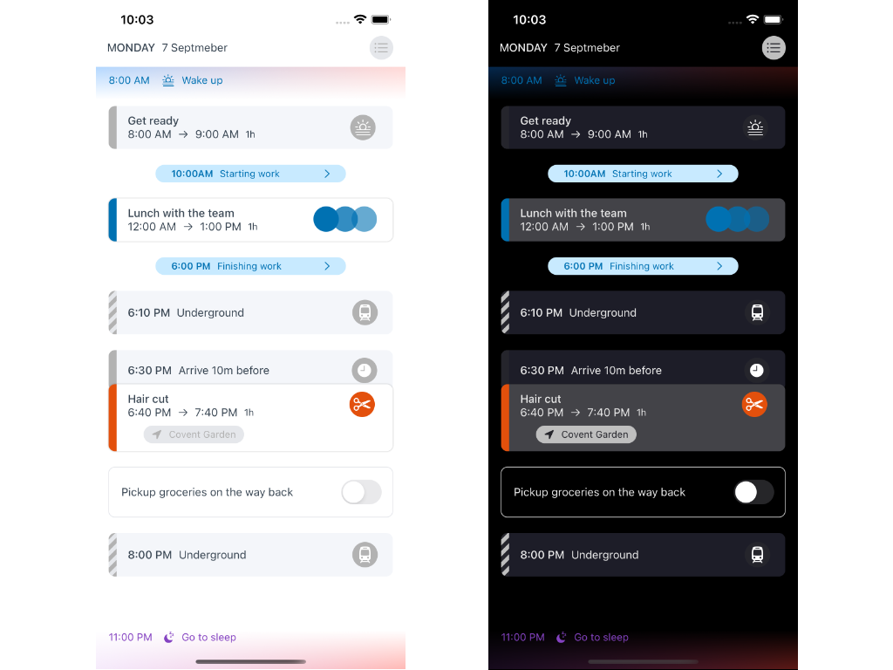

# DayBridge SwiftUI

    
    
    
    

I recently came across the [DayBridge calendar](https://daybridge.com) concept application, which is something they are building right now.

I liked the concept so much I thought I would spend a couple of hours and see how far I could get using their mobile design in SwiftUI, mainly for learning purposes and too see how far I could get in that limited time. 

**All credit for the design and concept belong to DayBridge**, however, the implementation is all my own work.

Here is the initial result:

And now with *DarkMode* too:

I think the results are pretty good.

As is often the case when doing something like this some things go well and others are a real challenge. I wanted to build a pure SwiftUI implementation, no other support files or assets. Immediately I thought how I could achieve the interesting gradients at the top and bottom of their column design. A  `LinearGeadient`, with another gradient as a mask.

Conversely, I never expected the chevron backgrounds—which appears to model times where you might not be contactable—would be the surprise challenge. The approach I ended up taking was to create a stack of lines and rotate them as needed. This worked out really well, and is a completely reusable component within the application, and now other applications too.

This approach works because in SwiftUI `Color` is a `View`. I know this is not a chevron as shown in the original design, but I think I have captured the same *intent* just not in the same way. In Real-world design-to-implementation it often goes that way.

## Design
There is not too much more I can get from their designs on their website for this experiment; if I want to do more on this I’m going to have to use my imagination and extrapolate what I think it will look.

No offence to the people at DayBridge, while I'm a fan of the concept, I'm not really of the design approach they have taken. In my opinion, as an app designer, their design is dated and has a real "web" focus; it does not attempt to be of-the-device or the iOS platform.

Therefore, at some point, as a new experiment I will update the design for this concept to be more modern and fit for an iOS device in today's AppStore. My plan here would be to explore a more Neumorphic design style, as I'm interested in exploring what challenges there could waiting for me when making something like this in both light and dark mode in that style.

## About Me
I have over 20 years of experience designing and building software for a living. My speciality is user interface design and development for mobile, specifically for the Apple ecosystem. I have been working with iOS since iOS6, initially with Objective-C and more recently with Swift and now SwiftUI. I have a proven track record of taking applications from concept to robust, scalable and secure applications, delivered and published through the AppStore. Within the last 5 years I have put over 30+ iOS and iPadOS apps successfully through the AppStore.

I work for companies large and small, as well as one-man-bands and start-ups, helping to make their ideas a reality. As an Architect I have extensive experience building backend services to support the mobile apps. I have used various languages over the years to build the services, but these days more typically in use Swift or Go (golang), with JSON messaging or REST based depending on the needs of the App features. Hosted in various ways from self hosting, PaaS, IaaS or Lambda. I have hands-on experience with various hosting platforms including iCloud, AWS, IBM, Digital Ocean and more, where security and performance is my primary focus.

## License
As this a learning project for me I would be really happy if anyone gets anything useful from the code. All the source code that is in this project is licensed under the MIT license. To be clear, this is any file that has the “.swift” file extension. Additionally, I have written all the code myself and have **not** used any code directly from any other sources.

The concept and design are Copyright © 2020 DayBridge. This project has been created without the permission or knowledge of DayBridge; any mistakes, omissions or errors are mine.

Here is the MIT license:

------

Copyright (c) 2021 Paul Jackson

Permission is hereby granted, free of charge, to any person obtaining a copy of this software and associated documentation files (the "Software"), to deal in the Software without restriction, including without limitation the rights to use, copy, modify, merge, publish, distribute, sublicense, and/or sell copies of the Software, and to permit persons to whom the Software is furnished to do so, subject to the following conditions:

The above copyright notice and this permission notice shall be included in all copies or substantial portions of the Software.

THE SOFTWARE IS PROVIDED "AS IS", WITHOUT WARRANTY OF ANY KIND, EXPRESS OR IMPLIED, INCLUDING BUT NOT LIMITED TO THE WARRANTIES OF MERCHANTABILITY, FITNESS FOR A PARTICULAR PURPOSE AND NONINFRINGEMENT. IN NO EVENT SHALL THE AUTHORS OR COPYRIGHT HOLDERS BE LIABLE FOR ANY CLAIM, DAMAGES OR OTHER LIABILITY, WHETHER IN AN ACTION OF CONTRACT, TORT OR OTHERWISE, ARISING FROM, OUT OF OR IN CONNECTION WITH THE SOFTWARE OR THE USE OR OTHER DEALINGS IN THE SOFTWARE.
