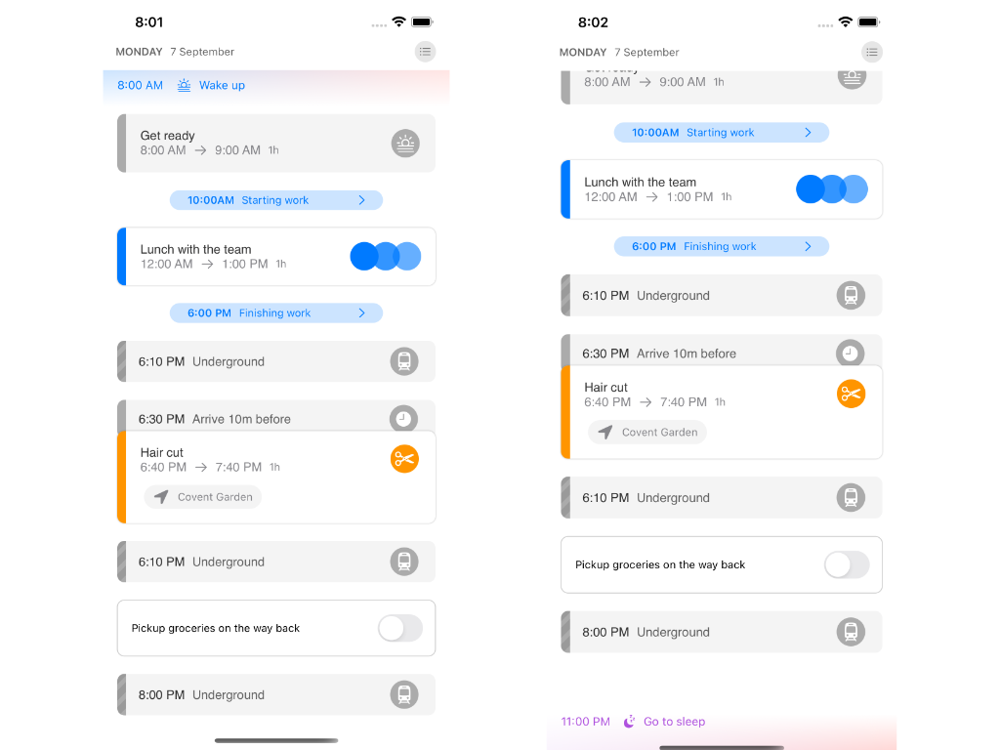
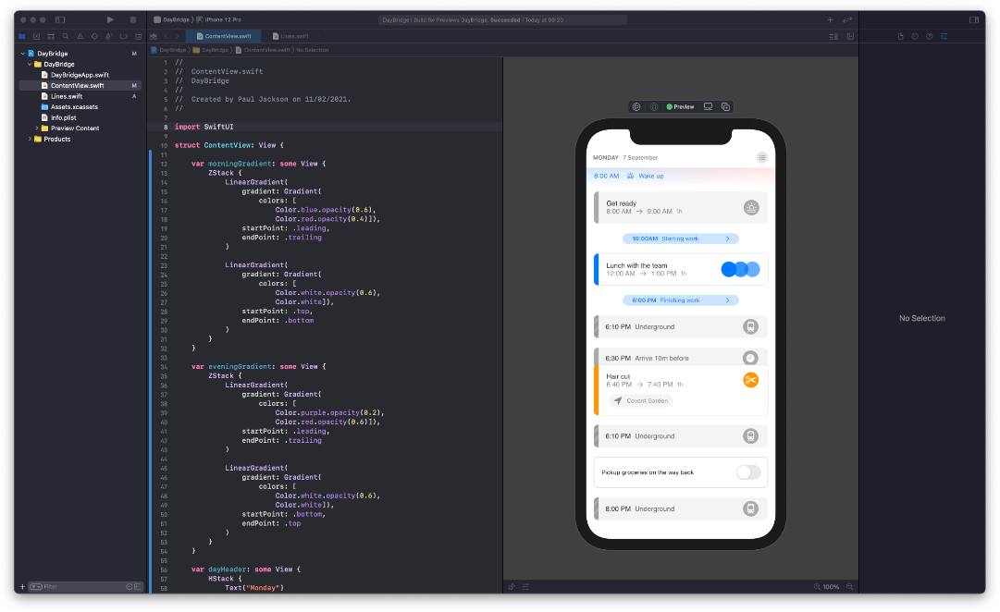
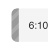

# DayBridge SwiftUI

    
    
    
    

I recently came across the [DayBridge calendar](https://daybridge.com) concept application, which is something they are building right now.

I liked the concept so much I thought I would spend a couple of hours and see how far I could get using their mobile design but with SwiftUI, just for learning and too see how far I could get. 

**All credit for the design and concept belong to DayBridge**, however, the implementation is all my own work.

Here is the initial result:

I think the results are pretty good. In the process of doing this I’ve grown to really like their concept and I'm looking forward to being able to use their app when it's released.

As is often the case when doing something like this some things go well and others are a real challenge. When I first saw the designs I wanted to build a pure SwiftUI design, no other support files or assets. Immediately I thought how I could achieve the interesting gradients at the top and bottom of their column design. A `ZStack` with a couple of overlaid `LinearGeadient`’s, that approach appears to have been very successful.

Conversely, I never expected the chevron backgrounds—which appears to model times where you might not be contactable—would be the surprise challenge. The approach I ended up taking was to create a stack of lines and rotate them as needed. This worked out really well, and is a completely reuable component within the application.

This approach works because in SwiftUI `Color` is a `View`. I know this is not a chevron as shown in the orginial design, but I think I have captured the same message if not in exactly the same way. Real-world design-to-implementation often goes that way.

## Next Steps

I’m really taken with what the people at DayBridge trying to build, unfortunately for me, there is not too much more I can get from their designs on their website. If I want to do more on this I’m going to have to use my imagination and extrapolate what I think it will look.

However, there are a few things I can do that do not require too much in the way of a set of new designs:

- Add support for Dark Mode
- Refactor the project layout
- Make the UI data driven

Dark mode pretty simple, as my implementation has a few *magic* numbers and colours; I simply need to define those and extract them. The project is essentially two files at the time of creating the project, so the idea here is to create a maintainable project layout and give the views their own files and so on. As for the data driven element, I could use CoreData to persist the data, or use a real calendar, maps and a ToDo list from somewhere, such a Google; but, it think I will try CoreData and Apple Maps to start with and see where that takes me. 

Finally, as I've said the DayBridge website does not give me too many hints on the feel for the whole design concept, so I will put on my designer hat and imagine how I think the views could look leading to this view I have already modelled, and then, when they release, I can see how close I got to their concept!

👍

## About Me

I have 20+ years of building software for a living, from Enterprise business apps, services and portals to mobile games and lots in between. I have personal experience of getting over 30+ iPhone and iPad apps through the AppStore process, having developed apps myself since iOS 6 onwards, initially with Objective-C and more recently with Swift and now SwiftUI.

My focus is user interface design and development for mobile, however, I have extensive experience building backend APIs for mobile services, typically written in Swift or Go (golang), with JSON messaging or REST based depending on the needs of the consumer and service. Hosted in various ways from self hosting, PaaS, IaaS or Lambda, experience with various hosting platforms including AWS, IBM, Digital Ocean and others. Backed by numerous datastore solutions including relational databases, ElasticSearch, CouchDB, Redis and other, where security and performance is my primary focus.

## License

As this a learning project for me I would be really happy if anyone gets anything useful from the code. All the source code that is in this project is licensed under the MIT license. To be clear, this is any file that has the “.swift” file extension. Additionally, I have written all the code myself and have **not** used any code directly from any other sources.

The concept and design are Copyright © 2020 Daybridge. This project has been created without the premission or knowledge of DayBridge; any mistakes, omissions or errors are mine.

Here is the MIT license:

------

Copyright (c) 2021 Paul Jackson

Permission is hereby granted, free of charge, to any person obtaining a copy of this software and associated documentation files (the "Software"), to deal in the Software without restriction, including without limitation the rights to use, copy, modify, merge, publish, distribute, sublicense, and/or sell copies of the Software, and to permit persons to whom the Software is furnished to do so, subject to the following conditions:

The above copyright notice and this permission notice shall be included in all copies or substantial portions of the Software.

THE SOFTWARE IS PROVIDED "AS IS", WITHOUT WARRANTY OF ANY KIND, EXPRESS OR IMPLIED, INCLUDING BUT NOT LIMITED TO THE WARRANTIES OF MERCHANTABILITY, FITNESS FOR A PARTICULAR PURPOSE AND NONINFRINGEMENT. IN NO EVENT SHALL THE AUTHORS OR COPYRIGHT HOLDERS BE LIABLE FOR ANY CLAIM, DAMAGES OR OTHER LIABILITY, WHETHER IN AN ACTION OF CONTRACT, TORT OR OTHERWISE, ARISING FROM, OUT OF OR IN CONNECTION WITH THE SOFTWARE OR THE USE OR OTHER DEALINGS IN THE SOFTWARE.
